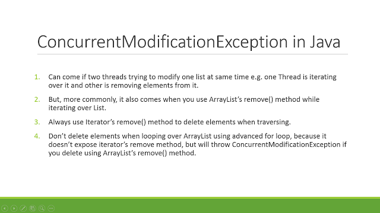
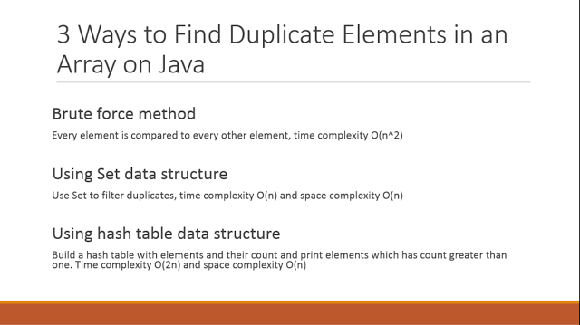
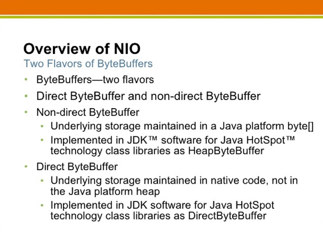
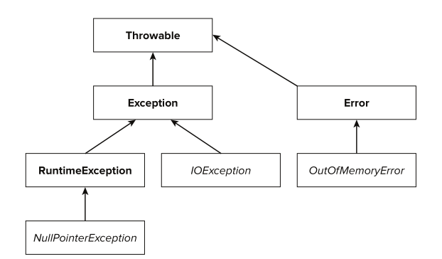

#单例
##内部类实现
```java
/**
 * 这些情况下就不用自己再来进行同步控制了。这些情况包括：
 * 
 * 1.由静态初始化器（在静态字段上或static{}块中的初始化器）初始化数据时
 * 
 * 2.访问final字段时
 * 
 * 3.在创建线程之前创建对象时
 * 
 * 4.线程可以看见它将要处理的对象时
 * 
 * @author earthlyfisher
 *
 */
public class SingleInstance {

	public SingleInstance() {
		super();
	}

	/**
	 * 类级的内部类，也就是静态的成员式内部类，该内部类的实例与外部类的实例 没有绑定关系，而且只有被调用到时才会装载，从而实现了延迟加载。
	 */
	private static class InstanseHolder {
		static{
			System.out.println("内部类加载");
		}
		/**
		 * 静态初始化器，由JVM来保证线程安全
		 */
		public static final SingleInstance instanse = new SingleInstance();
	}

	public static SingleInstance getInstance() {
		/**
		 * 当getInstance方法第一次被调用的时候，它第一次读取SingletonHolder.instance，
		 * 导致SingletonHolder类得到初始化；而这个类在装载并被初始化的时候，会初始化它的静态域，从而创建Singleton的实例，
		 * 由于是静态的域，因此只会在虚拟机装载类的时候初始化一次，并由虚拟机来保证它的线程安全性。
		 */
		return InstanseHolder.instanse;
	}
}
```
##枚举

```java
/**
 * 1.线程安全，通过类加载器保证线程安全。
 * 2.抗序列化问题：枚举类自己实现了readResolve（）方法，所以抗序列化，这个方法是当前类自己实现的（解决）
 * @author earthlyfisher
 *
 */
public enum SingleInstanceByEnum {

	instance;

	/**
	 * 单例可以有自己的操作
	 */
	public void singletonOperation() {
		System.out.println("hello world");
	}
}
```
#一些注意点
##获取JVM版本是32还是64
**可以检查某些系统属性如 `sun.arch.data.model` 或 `os.arch` 来获取该信息**
 即通过系统属性获取`System.getProperties()`
##switch case
`switch`支持`byte`,`short`,`int`,`boolean`,`char`,从1.7开始支持`String`,但这仅仅是一个语法糖。
内部实现在 switch 中使用字符串的 hashcode.但不支持`long`.
##精度问题
```java
public void testMulti() {
		System.out.println(3 * 0.1 == 0.3);// false:0.30000000000000004!=0.3,精度问题
	}
```
##direct-buffer,non-direct-buffer

```java
     /**
	 * Direct vs Non-direct vs MappedByteBuffer in Java: Direct buffers are
	 * allocated outside heap and they are not in control of Garbage Collection
	 * while non-direct buffers are simply a wrapper around byte arrays, located
	 * inside heap. Memory mapped files can be accessed by using
	 * MappedByteBuffer, which is also a direct buffer. One more thing to
	 * remember is that default order of bytes in ByteBuffer is BIG_ENDIAN,
	 * which means the bytes of a multibyte value are ordered from most
	 * significant to least significant.
	 * 
	 * Key advantage of Memory Mapped File is that operating system takes care
	 * of reading and writing and even if your program crashed just after
	 * writing into memory. OS will take care of writing content to File.
	 * 
	 * @throws IOException
	 * 
	 * 
	 */
	@SuppressWarnings("resource")
	@Test
	public void testIo() throws IOException {
		int count = 10485760; // 10 MB

		RandomAccessFile memoryMappedFile = new RandomAccessFile("D:\\test\\largeFile.txt", "rw");

		// Mapping a file into memory
		MappedByteBuffer out = memoryMappedFile.getChannel().map(FileChannel.MapMode.READ_WRITE, 0, count * 100);

		// Writing into Memory Mapped File
		for (int i = 0; i < count; i++) {
			out.put((byte) 'A');
		}

		System.out.println("Writing to Memory Mapped File is completed");

		// reading from memory file in Java
		for (int i = 0; i < 10; i++) {
			System.out.print((char) out.get(i));
		}
		System.out.println();
		System.out.println("Reading from Memory Mapped File is completed");

	}
```
##一个+运算符
```java
public static void main(String[] args) {
		byte a = 127;
		byte b = 127;
		b = a + b; // error : cannot convert from int to byte
		b += a; // ok:+= 隐式的将加操作的结果类型强制转换为持有结果的类型
	}
```
##ConcurrentModificationException while Iterating over ArrayList


##3 ways to find duplicate elements in an array Java


##Difference between Direct and Mapped ByteBuffer in Java

##异常的分类
所有异常都是Throwable的子类，根据使用类别分为Exception和Error，Error是由于系统问题造成的，如内存空间不足等，而Exception是具体的异常的父类，根据编译器和运行期分为受检查异常和运行时异常，具体的集成结构图如下:

##Map
`HashMap`通过hashtable实现key-value的存储，按照key的hashCode存储，可以有null key
`TreeMap`是有序的，通过key的Comparable比较器实现key-value的有序存储
`LinkedHashMap`也是有序的，也是通过key的hashCode存储，但是遍历是增加了有序属性，即与加入的顺序保持一致

##LinkedList与Queue
```java
public class LinkedList<E>
    extends AbstractSequentialList<E>
    implements List<E>, Deque<E>, Cloneable, java.io.Serializable
```
可知`LinkedList`实现了`Deque`，而`Deque`是丰富了父接口`Queue`，
`Queue`是Collection接口的子类，`Collection`实现了`Iterable`,所以是可遍历的。
而`Map`没有实现`Iterable`，但是通过一系列方法如`entrySet()`等转换成集合类`Set`来实现遍历功能.

##序列化和反序列化
`序列化可以将一个java对象以二进制流的方式在网络中传输并且可以被持久化到数据库、文件系统中，反序列化则是可以把之前持久化在数据库或文件系统中的二进制数据以流的方式读取出来重新构造成一个和之前相同内容的java对象。`
###示例
```java
ObjectOutputStream out = null;
		ObjectInputStream in = null;
		try {
			Customer customer = new Customer();
			customer.setId(1);
			customer.setName("Gavin");
			customer.setSalt("00000000011111111");
			File file = new File("D://customer.obj");
			
			//Serialization
			out = new ObjectOutputStream(new FileOutputStream(file));
			out.writeObject(customer);
			
			//deserialization
			in = new ObjectInputStream(new FileInputStream(file));
			Customer inCustomer = (Customer) in.readObject();
			System.out.println(inCustomer.toString());
		} catch (IOException e) {
			e.printStackTrace();
		} catch (ClassNotFoundException e) {
			System.out.println("happened to deserialization");
		} finally {
			if (null != out) {
				try {
					out.close();
				} catch (IOException e) {
					e.printStackTrace();
				}
			}
			if (null != in) {
				try {
					in.close();
				} catch (IOException e) {
					// TODO Auto-generated catch block
					e.printStackTrace();
				}
			}
		}
```
### 静态long类型常量`serialVersionUID`的作用
显示的设置`serialVersionUID`值就可以保证版本的兼容性，如果你在类中写上了这个值，就算类变动了，它反序列化的时候也能和文件中的原值匹配上。而新增的值则会设置成零值，删除的值则不会显示。
###summary
1. `序列化是深复制，反序列化还原后的对象地址与原来的的地址不同.`
2.  `static`,`transient`修饰的变量不能被序列化
##spring要点
###DI,IOC
DI(依赖注入)是spring的核心功能之一。DI能够删除任何特定的依赖于别的类或第三方接口的类，并且能够在初始化构造时加载要依赖的类。DI的优点是你可以依赖类的实现而并不需要更改你的代码。你甚至可以在接口不变的条件下重写依赖的实现而不用改变你的编码，即面向接口的编程。
###Spring beans定义和依赖实现方式
####XML 文本文件
通过XML文本文件构造Spring beans和依赖缺失了编译时的类型检查，任何问题比如构造器参数的类型错误，甚至是构造器错误的参数只有在application context在运行时构造时才会检查。
####使用注解
通过配置注解扫描的根包，并且在bean上使用注解@Service等标示他是一个bean
```java
@Autowired
private UserService userService;
	
@Service("userService")
public class UserServiceImpl implements UserService
```
```xml
   <!-- 开启注解配置 即Autowried -->  
    <context:annotation-config/>  
    
    <!--    使用自动注入的时候要  添加他来扫描bean之后才能在使用的时候   -->
    <context:component-scan base-package="com.wyp.module.service,com.wyp.module.dao"/>  
```
###spring mvc
####Configuring a servlet container
通过`org.springframework.web.servlet.DispatcherServlet`管理，在`web.xml`里面配置：
```
<servlet>
        <servlet-name>rest</servlet-name>
        <servlet-class>org.springframework.web.servlet.DispatcherServlet</servlet-class>
        <init-param>  
	      <param-name>contextConfigLocation</param-name>  
          <param-value>/WEB-INF/rest-servlet.xml</param-value>  
	</init-param>
	<!-- 这个配置文件在容器启动的时候 就加载 -->
    <load-on-startup>1</load-on-startup>
    </servlet>
    <servlet-mapping>
        <servlet-name>rest</servlet-name>
        <url-pattern>/</url-pattern>
    </servlet-mapping>
```
如果
```
<init-param>  
	      <param-name>contextConfigLocation</param-name>  
          <param-value>/WEB-INF/rest-servlet.xml</param-value>  
	</init-param>
```
不指定，则默认会加载该文件` WEB-INF/[servlet-name]-servlet.xml`.
###代理模式和装饰模式的区别
两者是相似，但是有些细微的区别，主要是方法粒度不一样，装饰模式一般只是对特定行为方法增加额外职责；而代理模式则是所有方法增加新职责，而且 这个新职责是一个方面或一系列的，并且装饰模式可以有装饰链。
###路径获取
```java
/**
		 * this.getClass().getResource(""):当前类所在目录
		 */
		System.out.println(this.getClass().getResource("")); 
		/**
		 * this.getClass().getResource("/"):classpath所在目录
		 */
		System.out.println(this.getClass().getResource("/"));
	    /**
	     * this.getClass().getClassLoader().getSystemResource(""):classpath所在目录
	     */
		System.out.println(this.getClass().getClassLoader().getSystemResource(""));
```
###常量池的变化
JDK1.7的新变化，将`constant pool`从`pemgen`挪到了`heap`，对于`intern`操作首先判断对中有没有该常亮的引用，如果没有，则直接此对象就成为常量，可通过以下代码查看。
```java
public static void testForJDK17() {
		String a = "e";
		String b="f";
		String c=a+b;
		String d=a+b;
		System.out.println(c==c.intern());//true
		System.out.println(d==d.intern());//false
		System.out.println(c==d.intern());//true
	}
```
以下是具体描述
>Area: HotSpot
>
Synopsis: In JDK 7, interned strings are no longer allocated in the permanent generation of the Java heap, but are instead allocated in the main part of the Java heap (known as the young and old generations), along with the other objects created by the application. This change will result in more data residing in the main Java heap, and less data in the permanent generation, and thus may require heap sizes to be adjusted. Most applications will see only relatively small differences in heap usage due to this change, but larger applications that load many classes or make heavy use of the String.intern() method will see more significant differences.
###i++,i=i++
`i++`对应bytecode
```
0: iconst_1       #将int型常量1push到操作数栈，当前栈顶的值为1 
1: istore_0       #pop操作数栈顶值1到局部变量表，赋给i值为1
2: iinc          0, 1  #自增指令，将局部变量的值加1，执行完成后，该变量值为2
5: return        
```
`i=i++`对应bytecode
```
0: iconst_1       #将int型常量1push到操作数栈，当前栈顶的值为1 
1: istore_0       #pop操作数栈顶值1到局部变量表，赋给i值为1
2: iload_0        #将局部变量表i的值push到操作数栈顶，，当前栈顶的值为1
3: iinc          0, 1 #自增指令，将局部变量的值加1，执行完成后，该变量值为2
6: istore_0       #pop操作数栈顶值1到局部变量表，赋给i值为1
7: return  
```
##JUC
`java`并发包提供了一些更高级的工具，如`ReentrantLock`,`CountDownLatch`,`CyclicBarrier`,`Exchanger`,`Fork/Join`,
`Phaser`,`Semaphore`.
###`ReentrantLock`
`ReentrantLock`起到了锁的作用，保护代码块，同`synchronized`作用相同，但比较耗时
```java
Lock lock = new ReentrantLock();  
lock.lock();  
try {   
  // update object state  
}  
finally {  
  lock.unlock();   
}  
```
###`CountDownLatch`
`CountDownLatch`能是所有线程等待，直到其他线程结束操作，通过`await`做等待操作，直到`countDown`操作使`Latch`为0，则执行后续的操作.
```java
private static void process() {
		final CountDownLatch countDownLatch=new CountDownLatch(1);
		System.out.println("我是领导，请大家等待统一行动口号");
		for(int i=0;i<3;i++){
			final int num=i;
			new Thread(){
				@Override
				public void run() {
					System.out.println("我是线程 "+num+" ,我在等待统一行动");
					try {
						countDownLatch.await();
					} catch (InterruptedException e) {
						e.printStackTrace();
					}
					System.out.println("我是线程 "+num+" ,我们开始行动了");
				}
			}.start();
		}
		//领导做准备工作
		try {
			Thread.sleep(20L);
		} catch (InterruptedException e) {
			e.printStackTrace();
		}
		System.out.println("时间到了，各位开始行动！");
		countDownLatch.countDown();
	}
```
###`CyclicBarrier`
`CyclicBarrier`是回环栅栏，通过`await`操作等待在`barrier`，当所有线程都到达`barrier`时,会推选任一线程执行`barrierAction`.并且会执行后续的操作.`CyclicBarrier`可重复使用.
```java
private final static int GROUP_SIZE = 5;

	private final static Random random = new Random();

	public static void main(String[] args) throws InterruptedException {
		processOneGroup("分组1");
	}

	private static void processOneGroup(final String groupName) throws InterruptedException {
		final CyclicBarrrierRunnable runnable = new CyclicBarrrierRunnable("prepare", groupName);
		final CyclicBarrier CYCLIC_BARRIER = new CyclicBarrier(GROUP_SIZE, runnable);

		for (int i = 0; i < GROUP_SIZE; i++) {
			new Thread(String.valueOf(i)) {
				public void run() {
					try {
						CYCLIC_BARRIER.await();
					} catch (InterruptedException | BrokenBarrierException e1) {
						// TODO Auto-generated catch block
						e1.printStackTrace();
					}
					System.out.println("我是线程组：【" + groupName + "】,第：" + this.getName() + " 号线程,我已经准备就绪！");
					
					try {
						runnable.setType("start");
						CYCLIC_BARRIER.await();
					} catch (InterruptedException | BrokenBarrierException e1) {
						e1.printStackTrace();
					}
					
					try {
						Thread.sleep(Math.abs(random.nextInt()) % 1000);
					} catch (InterruptedException e) {
						e.printStackTrace();
					}
					System.out.println("我是线程组：【" + groupName + "】,第：" + this.getName() + " 号线程,我已执行完成！");
					
					try {
						runnable.setType("end");
						CYCLIC_BARRIER.await();
					} catch (InterruptedException | BrokenBarrierException e) {
						e.printStackTrace();
					}
				}
			}.start();
		}
	}
```
###`Exchanger`
`Exchanger`主要用来作为两线程交换数据使用，当线程调用`exchange`操作使，线程进入阻塞状，当其他线程也调用时，将数据交换，执行后续操作.
```java
public static void main(String[] args) {
		final Exchanger<Integer> exchanger = new Exchanger<Integer>();
		for (int i = 0; i < 2; i++) {
			final Integer num = i;
			new Thread() {
				public void run() {
					System.out.println("我是线程：Thread_" + this.getName() + " 我的数据是：" + num);
					try {
						Integer exchangeNum = exchanger.exchange(num);
						Thread.sleep(1000);
						System.out.println(
								"我是线程：Thread_" + this.getName() + " 最初的数据为：" + num + " , 交换后的数据为：" + exchangeNum);
					} catch (InterruptedException e) {
						e.printStackTrace();
					}
				}
			}.start();
		}
	}
```
###`Fork/Join`
`Fork/Join`采用分而治之的思想来管理，即首先通过分割任务，最后合并任务的方式来实现.
`Fork/Join`通过使用`ForkJoinTask`和`ForkJoinPool`来完成.
其中`ForkJoinTask`提供了以下两个子类：
. RecursiveAction：用于没有返回结果的任务。
. RecursiveTask ：用于有返回结果的任务。
让我们通过一个简单的需求来使用下`Fork／Join`框架，需求是：计算`1+2+3+4`的结果。
使用`Fork／Join`框架首先要考虑到的是如何分割任务，如果我们希望每个子任务最多执行两个数的相加，那么我们设置分割的阈值是2，由于是4个数字相加，所以`Fork／Join`框架会把这个任务`fork`成两个子任务，子任务一负责计算1+2，子任务二负责计算3+4，然后再`join`两个子任务的结果。
```java
static class CountComputer extends RecursiveTask<Integer> {

		private static final long serialVersionUID = 2245387215783142216L;

		private final static int THRESHOLD = 2;

		private int start;

		private int end;

		public CountComputer(int start, int end) {
			this.start = start;
			this.end = end;
		}

		@Override
		public Integer compute() {
             int sum=0;
             boolean canCompute=end-start<=THRESHOLD;
             if(canCompute){
            	 for(int i=start;i<=end;i++){
            		 sum+=i;
            	 }
             }else{
            	 int middle=(start+end)/2;
            	 CountComputer leftCount=new CountComputer(start, middle);
            	 CountComputer rightCount=new CountComputer(middle+1, end);
            	 
            	 //执行子任务
            	 leftCount.fork();
            	 rightCount.fork();
            	 
            	 //等待子任务结束，并得到执行结果
            	 sum=leftCount.join()+rightCount.join();
             }
			return sum;
		}
	}

	public static void main(String[] args) throws InterruptedException, ExecutionException {
		ForkJoinPool pool = new ForkJoinPool();
		CountComputer task=new CountComputer(1, 4);
		pool.submit(task);
		System.out.println(task.get());
	}
```
###`Semaphore`
`Semaphore`即信号量，通过信号量，控制对公共资源的访问.通过`acquire`等待资源的获取，`release`释放资源.
```java
private final static Semaphore MAX_SEMA_PHORE = new Semaphore(5);
	
	private final static SimpleDateFormat DEFAULT_DATE_FORMAT = new SimpleDateFormat("yyyy-MM-dd HH:mm:ss");

	public static String getDateTime() {
        Date datetime = Calendar.getInstance().getTime();
        return DEFAULT_DATE_FORMAT.format(datetime);
    }
	
	public static void main(String[] args) {
		for (int i = 0; i < 20; i++) {
			final int num = i;
			final Random radom = new Random();
			new Thread() {
				public void run() {
					boolean acquired = false;
					try {
						MAX_SEMA_PHORE.acquire();
						acquired = true;
						System.out.println("我是线程：" + num + " 我获得了使用权！" + getDateTime());
						Thread.sleep(1000 + (radom.nextInt() & 5000));
						System.out.println("我是线程：" + num + " 我执行完了！" + getDateTime());
					} catch (Exception e) {
						e.printStackTrace();
					} finally {
						if (acquired) {
							MAX_SEMA_PHORE.release();
						}
					}
				}
			}.start();
		}
	}
```


